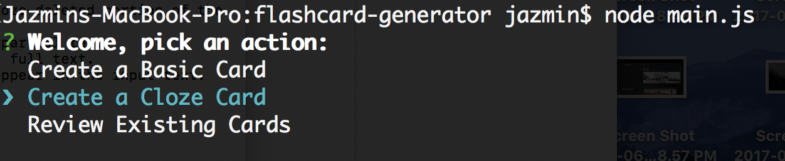
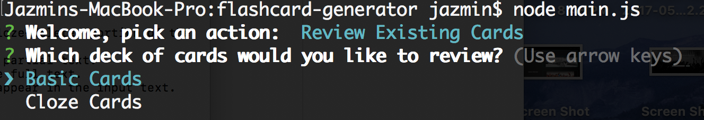

# Cloze Constructors

### Overview

Using Node.js, I created the backend for a basic flashcard application.  The backend will essentially constitute an API that allows users to create two types of flashcards:
* Basic flashcards, which have a front ("Who was the first president of the United States?"), and a back ("George Washington").  
* Cloze-Deleted flashcards, which present partial text ("... was the first president of the United States."), and the full text when the user requests it ("George Washington was the first president of the United States.")

### User Instructions

1. Run `node main.js`
2. Pick one of the following options:

3. `Create a Basic Card` will prompt you to enter the front and back of a flashcard
4. `Create a Cloze Card` will prompt you to enter the full text of the card and cloze deletion (the text you've chosen to remove).
5. Lastly, by choosing `Review Existing Cards` you can review the Basic Cards deck or Cloze Cards deck.

### App Guidelines

1. Create a new file named `BasicCard.js`:

    * This file should define a Node module that exports a constructor for creating basic flashcards, e.g.: `module.exports = BasicCard;`
    * The constructor should accept two arguments: `front` and `back`.
    * The constructed object should have a `front` property that contains the text on the front of the card.
    * The constructed object should have a `back` property that contains the text on the back of the card.

2. Create a new file named `ClozeCard.js`:

    * This file should define a Node module that exports a constructor for creating cloze-deletion flashcards, e.g.: `module.exports = ClozeCard;`
    * The constructor should accept two arguments: `text` and `cloze`.
    * The constructed object should have a `cloze` property that contains only the cloze-deleted portion of the text.
    * The constructed object should have a `partial` property that contains only the partial text.
    * The constructed object should have a `fullText` property that contains only the full text.
    * The constructor should throw or log an error when the cloze deletion does not appear in the input text.
    * Use prototypes to attach these methods, wherever possible.
